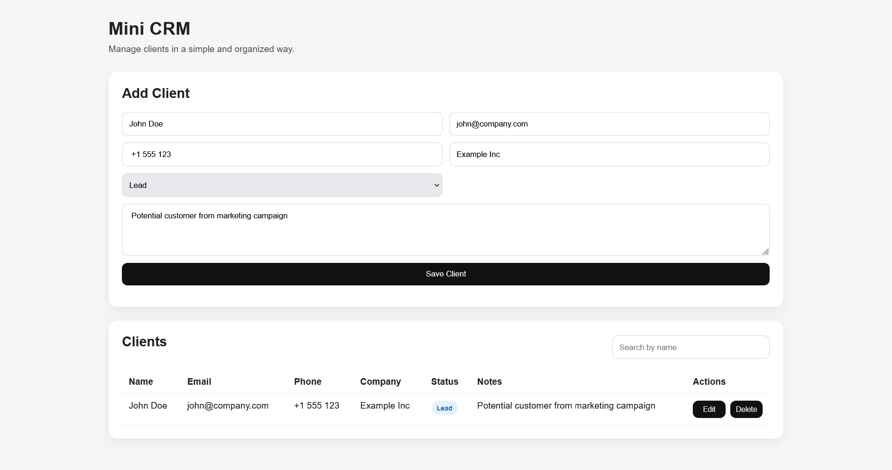

# Mini CRM (Supabase)

A simple CRM system to manage clients using HTML, CSS, JavaScript, and Supabase

## Features

- Create clients
- Edit clients
- Delete clients
- Search clients
- Client status tracking
- Supabase database integration

## Technologies

- HTML
- CSS
- JavaScript
- Supabase

## Database Structure

Table: `clients`

Fields:
- id
- created_at
- name
- email
- phone
- company
- status
- notes

## Screenshot

## Future Improvements

- Authentication
- Pagination
- Status filters
- Dashboard metrics